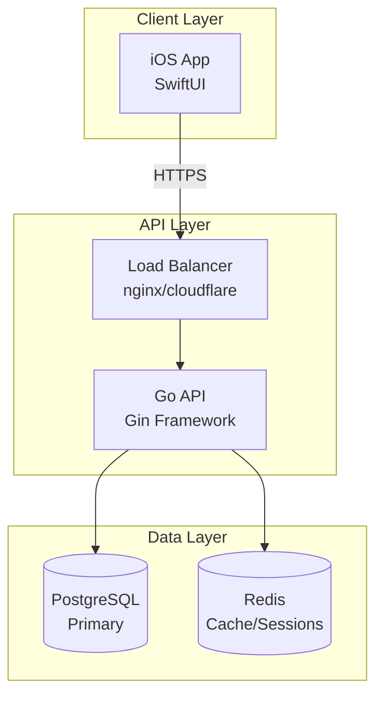
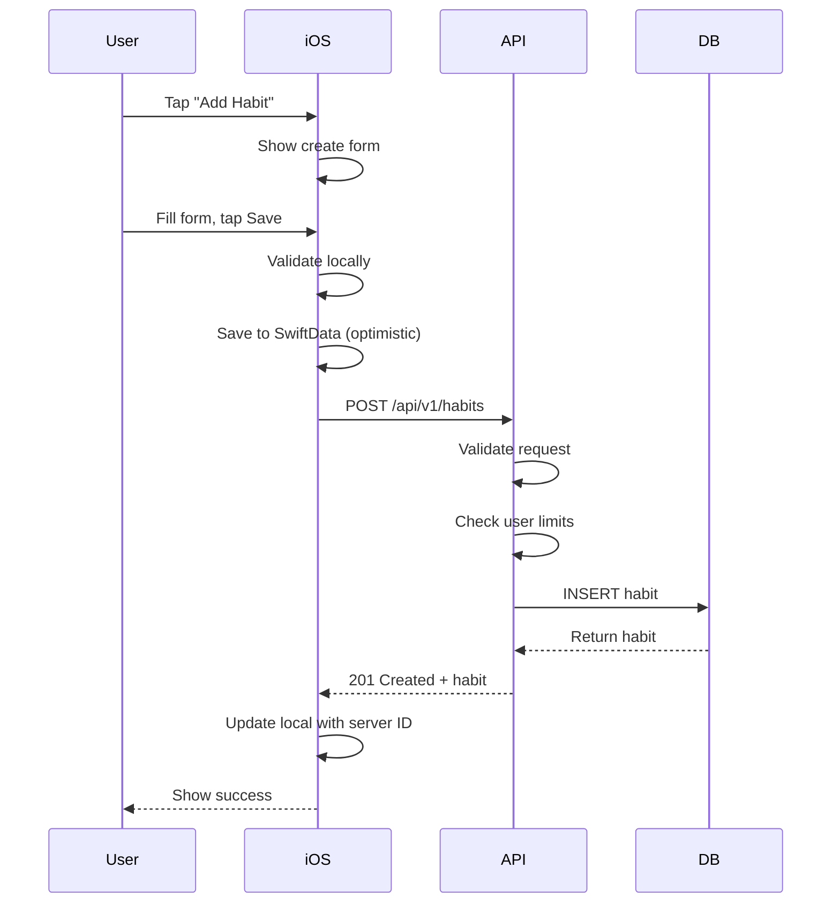
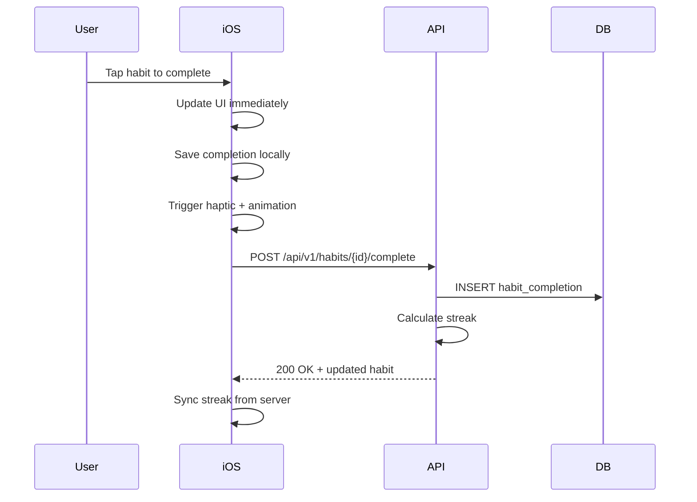
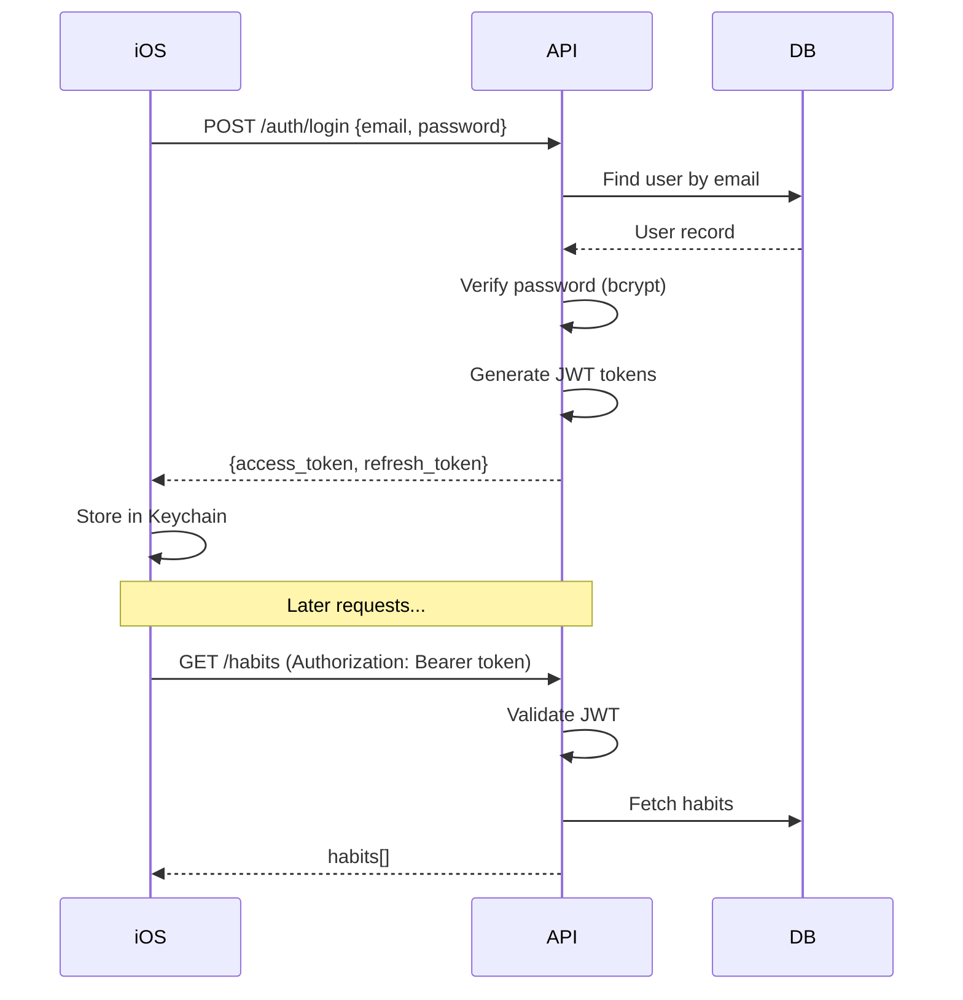
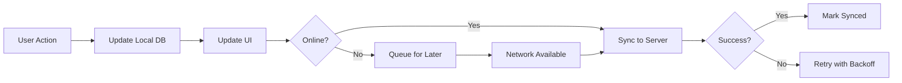
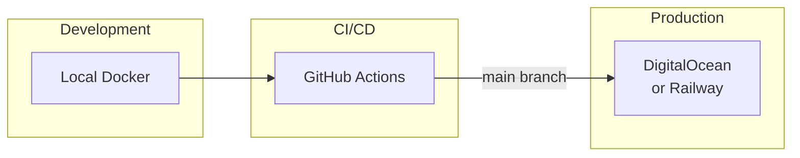

# Architecture Overview

## System Diagram

## Components

### iOS App (SwiftUI)

**Responsibilities**:
- User interface
- Local data storage (SwiftData)
- Offline support
- Sync with backend

**Architecture**: MVVM + Repository Pattern
- **Views**: SwiftUI views
- **ViewModels**: ObservableObject, business logic
- **Repositories**: Data access abstraction
- **Services**: Network, storage, sync

### Go API (Gin Framework)

**Responsibilities**:
- REST API endpoints
- Authentication (JWT)
- Business logic validation
- Data persistence

**Architecture**: Clean Architecture
- **Handler**: HTTP request/response
- **UseCase**: Business logic
- **Repository**: Data access
- **Domain**: Entities, interfaces

### PostgreSQL

**Responsibilities**:
- Primary data storage
- ACID transactions
- Data integrity

### Redis (Future)

**Responsibilities**:
- Session storage
- Rate limiting
- Caching hot data

## Data Flow

### Create Habit Flow

### Complete Habit Flow

## Authentication Flow

## Offline-First Strategy

### Principles

1. **Local first**: All data stored locally in SwiftData
2. **Optimistic updates**: UI updates before server confirms
3. **Background sync**: Sync happens automatically when online
4. **Conflict resolution**: Last-write-wins with server timestamp

### Sync Flow

### Conflict Resolution

| Scenario | Resolution |
|----------|------------|
| Same field modified | Server timestamp wins |
| Habit deleted on server | Remove from local |
| Habit created offline | Assign server ID on sync |
| Completion conflict | Both kept (union) |

## Security

### Authentication
- JWT tokens with RS256 signing
- Access token: 15 minutes
- Refresh token: 7 days
- Tokens stored in iOS Keychain

### Data Protection
- HTTPS only (TLS 1.3)
- Passwords hashed with bcrypt (cost 12)
- SQL injection prevention (parameterized queries)
- Input validation on all endpoints

### Rate Limiting
- 100 requests/minute per user
- 10 login attempts per hour
- 429 response when exceeded

## Scalability

### Current (MVP)
- Single API instance
- Single PostgreSQL instance
- ~1000 users target

### Future
- Horizontal API scaling (stateless)
- PostgreSQL read replicas
- Redis for caching
- CDN for static assets

## Monitoring

### Metrics (Future)
- Request latency (p50, p95, p99)
- Error rate
- Database connection pool
- Active users

### Logging
- Structured JSON logs
- Request ID for tracing
- No sensitive data in logs

## Deployment

See [deploy/README.md](/deploy/README.md) for deployment instructions.

