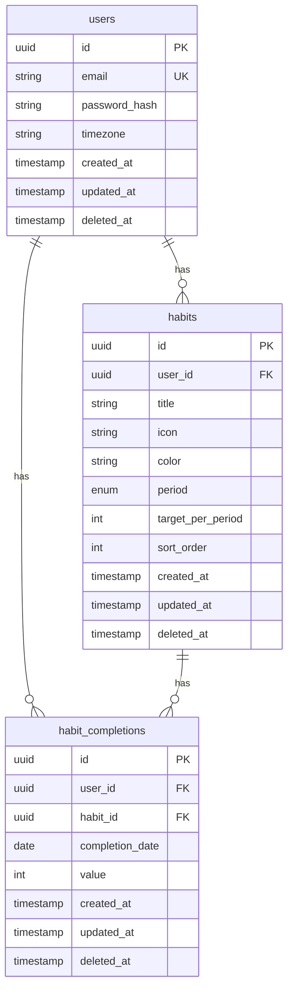

# Database Schema

## ER Diagram



## Tables

### users

Primary user table.

| Column | Type | Constraints | Description |
|--------|------|-------------|-------------|
| id | UUID | PK, DEFAULT gen_random_uuid() | Primary key |
| email | VARCHAR(255) | UNIQUE, NOT NULL | User email (lowercase) |
| password_hash | VARCHAR(255) | NOT NULL | Bcrypt hash |
| timezone | VARCHAR(50) | DEFAULT 'UTC' | User timezone (IANA) |
| created_at | TIMESTAMPTZ | DEFAULT NOW() | Creation time |
| updated_at | TIMESTAMPTZ | DEFAULT NOW() | Last update time |
| deleted_at | TIMESTAMPTZ | NULL | Soft delete time |

**Indexes**:
- `idx_users_email` ON email WHERE deleted_at IS NULL

---

### habits

User habits.

| Column | Type | Constraints | Description |
|--------|------|-------------|-------------|
| id | UUID | PK, DEFAULT gen_random_uuid() | Primary key |
| user_id | UUID | FK users(id), NOT NULL | Owner |
| title | VARCHAR(50) | NOT NULL | Habit name |
| icon | VARCHAR(50) | NOT NULL | SF Symbol name |
| color | VARCHAR(20) | NOT NULL | Color name |
| period | VARCHAR(10) | NOT NULL | daily/weekly/monthly |
| target_per_period | INT | DEFAULT 1 | Times per period |
| sort_order | INT | DEFAULT 0 | Display order |
| created_at | TIMESTAMPTZ | DEFAULT NOW() | Creation time |
| updated_at | TIMESTAMPTZ | DEFAULT NOW() | Last update time |
| deleted_at | TIMESTAMPTZ | NULL | Soft delete time |

**Indexes**:
- `idx_habits_user_id` ON user_id WHERE deleted_at IS NULL
- `idx_habits_user_period` ON (user_id, period) WHERE deleted_at IS NULL

**Constraints**:
- CHECK (period IN ('daily', 'weekly', 'monthly'))
- CHECK (target_per_period > 0)

---

### habit_completions

Habit completion records.

| Column | Type | Constraints | Description |
|--------|------|-------------|-------------|
| id | UUID | PK, DEFAULT gen_random_uuid() | Primary key |
| user_id | UUID | FK users(id), NOT NULL | Owner |
| habit_id | UUID | FK habits(id), NOT NULL | Habit |
| completion_date | DATE | NOT NULL | Date of completion |
| value | INT | DEFAULT 1 | Completion count |
| created_at | TIMESTAMPTZ | DEFAULT NOW() | Creation time |
| updated_at | TIMESTAMPTZ | DEFAULT NOW() | Last update time |
| deleted_at | TIMESTAMPTZ | NULL | Soft delete time |

**Indexes**:
- `idx_completions_habit_date` ON (habit_id, completion_date) WHERE deleted_at IS NULL
- `idx_completions_user_date` ON (user_id, completion_date) WHERE deleted_at IS NULL

**Constraints**:
- UNIQUE (habit_id, completion_date) WHERE deleted_at IS NULL
- CHECK (value > 0)

---

## SQL Migrations

### 001_create_users.up.sql

```sql
-- Enable UUID extension
CREATE EXTENSION IF NOT EXISTS "pgcrypto";

-- Create users table
CREATE TABLE users (
    id UUID PRIMARY KEY DEFAULT gen_random_uuid(),
    email VARCHAR(255) NOT NULL,
    password_hash VARCHAR(255) NOT NULL,
    timezone VARCHAR(50) NOT NULL DEFAULT 'UTC',
    created_at TIMESTAMPTZ NOT NULL DEFAULT NOW(),
    updated_at TIMESTAMPTZ NOT NULL DEFAULT NOW(),
    deleted_at TIMESTAMPTZ
);

-- Unique email index (only active users)
CREATE UNIQUE INDEX idx_users_email
    ON users(email)
    WHERE deleted_at IS NULL;

-- Updated_at trigger
CREATE OR REPLACE FUNCTION update_updated_at()
RETURNS TRIGGER AS $$
BEGIN
    NEW.updated_at = NOW();
    RETURN NEW;
END;
$$ LANGUAGE plpgsql;

CREATE TRIGGER users_updated_at
    BEFORE UPDATE ON users
    FOR EACH ROW
    EXECUTE FUNCTION update_updated_at();
```

### 001_create_users.down.sql

```sql
DROP TRIGGER IF EXISTS users_updated_at ON users;
DROP FUNCTION IF EXISTS update_updated_at;
DROP TABLE IF EXISTS users;
```

### 002_create_habits.up.sql

```sql
-- Create habits table
CREATE TABLE habits (
    id UUID PRIMARY KEY DEFAULT gen_random_uuid(),
    user_id UUID NOT NULL REFERENCES users(id) ON DELETE CASCADE,
    title VARCHAR(50) NOT NULL,
    icon VARCHAR(50) NOT NULL,
    color VARCHAR(20) NOT NULL,
    period VARCHAR(10) NOT NULL CHECK (period IN ('daily', 'weekly', 'monthly')),
    target_per_period INT NOT NULL DEFAULT 1 CHECK (target_per_period > 0),
    sort_order INT NOT NULL DEFAULT 0,
    created_at TIMESTAMPTZ NOT NULL DEFAULT NOW(),
    updated_at TIMESTAMPTZ NOT NULL DEFAULT NOW(),
    deleted_at TIMESTAMPTZ
);

-- Indexes
CREATE INDEX idx_habits_user_id
    ON habits(user_id)
    WHERE deleted_at IS NULL;

CREATE INDEX idx_habits_user_period
    ON habits(user_id, period)
    WHERE deleted_at IS NULL;

-- Updated_at trigger
CREATE TRIGGER habits_updated_at
    BEFORE UPDATE ON habits
    FOR EACH ROW
    EXECUTE FUNCTION update_updated_at();
```

### 002_create_habits.down.sql

```sql
DROP TRIGGER IF EXISTS habits_updated_at ON habits;
DROP TABLE IF EXISTS habits;
```

### 003_create_habit_completions.up.sql

```sql
-- Create habit_completions table
CREATE TABLE habit_completions (
    id UUID PRIMARY KEY DEFAULT gen_random_uuid(),
    user_id UUID NOT NULL REFERENCES users(id) ON DELETE CASCADE,
    habit_id UUID NOT NULL REFERENCES habits(id) ON DELETE CASCADE,
    completion_date DATE NOT NULL,
    value INT NOT NULL DEFAULT 1 CHECK (value > 0),
    created_at TIMESTAMPTZ NOT NULL DEFAULT NOW(),
    updated_at TIMESTAMPTZ NOT NULL DEFAULT NOW(),
    deleted_at TIMESTAMPTZ
);

-- Unique constraint: one completion per habit per day
CREATE UNIQUE INDEX idx_completions_habit_date_unique
    ON habit_completions(habit_id, completion_date)
    WHERE deleted_at IS NULL;

-- Index for querying by user and date
CREATE INDEX idx_completions_user_date
    ON habit_completions(user_id, completion_date)
    WHERE deleted_at IS NULL;

-- Index for querying by habit
CREATE INDEX idx_completions_habit
    ON habit_completions(habit_id)
    WHERE deleted_at IS NULL;

-- Updated_at trigger
CREATE TRIGGER habit_completions_updated_at
    BEFORE UPDATE ON habit_completions
    FOR EACH ROW
    EXECUTE FUNCTION update_updated_at();
```

### 003_create_habit_completions.down.sql

```sql
DROP TRIGGER IF EXISTS habit_completions_updated_at ON habit_completions;
DROP TABLE IF EXISTS habit_completions;
```

---

## Future Tables (Phase 2+)

### tasks

```sql
CREATE TABLE tasks (
    id UUID PRIMARY KEY DEFAULT gen_random_uuid(),
    user_id UUID NOT NULL REFERENCES users(id),
    title VARCHAR(200) NOT NULL,
    status VARCHAR(20) NOT NULL DEFAULT 'pending',
    due_date DATE,
    sort_order INT NOT NULL DEFAULT 0,
    created_at TIMESTAMPTZ NOT NULL DEFAULT NOW(),
    updated_at TIMESTAMPTZ NOT NULL DEFAULT NOW(),
    completed_at TIMESTAMPTZ,
    deleted_at TIMESTAMPTZ
);
```

### budget_categories

```sql
CREATE TABLE budget_categories (
    id UUID PRIMARY KEY DEFAULT gen_random_uuid(),
    user_id UUID NOT NULL REFERENCES users(id),
    name VARCHAR(50) NOT NULL,
    icon VARCHAR(50) NOT NULL,
    color VARCHAR(20) NOT NULL,
    budget_limit DECIMAL(12,2),
    created_at TIMESTAMPTZ NOT NULL DEFAULT NOW(),
    updated_at TIMESTAMPTZ NOT NULL DEFAULT NOW(),
    deleted_at TIMESTAMPTZ
);
```

### transactions

```sql
CREATE TABLE transactions (
    id UUID PRIMARY KEY DEFAULT gen_random_uuid(),
    user_id UUID NOT NULL REFERENCES users(id),
    category_id UUID REFERENCES budget_categories(id),
    amount DECIMAL(12,2) NOT NULL,
    type VARCHAR(10) NOT NULL, -- income/expense
    note VARCHAR(200),
    transaction_date TIMESTAMPTZ NOT NULL,
    created_at TIMESTAMPTZ NOT NULL DEFAULT NOW(),
    updated_at TIMESTAMPTZ NOT NULL DEFAULT NOW(),
    deleted_at TIMESTAMPTZ
);
```
